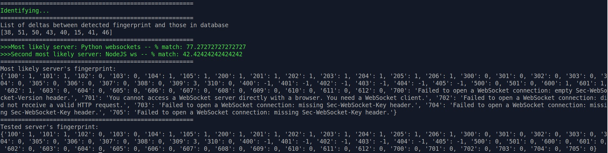
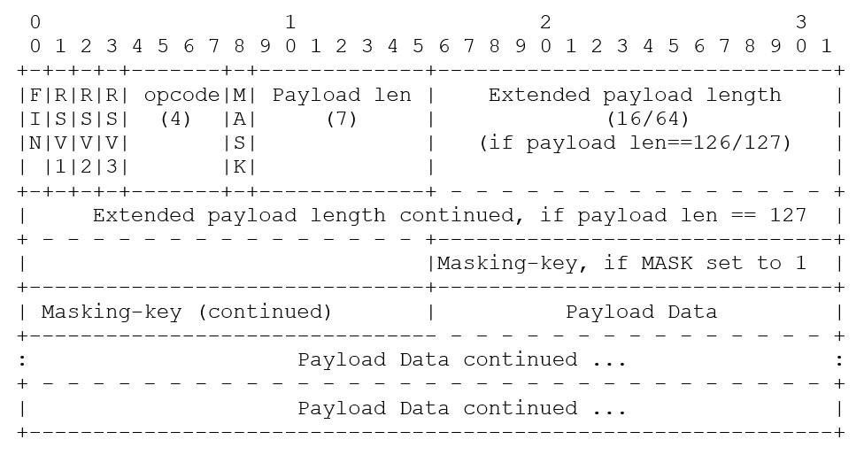

# STEWS Fingerprinting Tool

The STEWS (Security Tool for Enumerating WebSockets) fingerprint tool uses
implementation-level differences in popular WebSocket implementations to try to
identify running WebSocket servers. The STEWS fingerprinting tool uses server
features both in the WebSocket handshake (using the HTTP protocol)
and in the WebSocket protocol frames (using the WebSocket protocol),
requiring the tool to handle two different protocols.



## WebSockets Fingerprint Tests

In the process of testing different WebSocket servers, differences in
implementation were found that helped identify different WebSocket servers.
These differences could allow a user to identify a server
by sending crafted messages that triggered the servers to respond with their
identifying features. Some identifiers were found to be better
(or higher signal-to-noise for identification) than others.

For example, the capitalization of HTTP headers in the WebSocket handshake
response can be modified by a reverse proxy or other intermediate network
element, regardless of the WebSocket implementation's source code.
Similarly, no major differences were found in server responses when
different masking keys were used to send messages to servers. To examine other
possible fingerprinting client requests, it can be helpful to examine the
format of the WebSocket data frame from RFC6455.



## Basic Usage

First, make sure you have the necessary Python 3 dependencies installed using
`pip3 install -r requirements.txt`. Then if you run
`python3 STEWS-fingerprint.py -h` you will be greeted by the following options:

```
usage: STEWS-fingerprint.py [-h] [-v] [-d] [-u URL] [-f FILE] [-n] [-k]
                            [-o ORIGIN] [-g] [-a] [-1] [-2] [-3] [-4] [-5]
                            [-6] [-7]

Security Testing and Enumeration of WebSockets (STEWS) Fingerprinting Tool

optional arguments:
  -h, --help            show this help message and exit
  -v, --verbose         Enable verbose tracing of communications
  -d, --debug           Print each test case to track progress while running
  -u URL, --url URL     Provide a URL to connect to
  -f FILE, --file FILE  Provide a file containing URLs to check for valid
                        WebSocket connections
  -n, --no-encryption   Connect using ws://, not wss:// (default is wss://)
  -k, --nocert          Ignore invalid SSL cert
  -o ORIGIN, --origin ORIGIN
                        Set origin
  -g, --generate-fingerprint
                        Generate a fingerprint for a known server
  -a, --all-tests       Run all tests
  -1, --series-100      Run the 100-series (opcode) tests
  -2, --series-200      Run the 200-series (rsv bit) tests
  -3, --series-300      Run the 300-series (version) tests
  -4, --series-400      Run the 400-series (extensions) tests
  -5, --series-500      Run the 500-series (subprotocols) tests
  -6, --series-600      Run the 600-series (long payloads) tests
  -7, --series-700      Run the 700-series (hybi and similar) tests
```

Each series of tests enumerates a specific part of the WebSocket protocol. If
you want to see how the tool works, try running a single series of test first,
such as the 500 series tests. It is useful to add the debug flag, `-d`, to
observe the progress as test cases are being run.
If you have a server running on local port 8080
and want to test the 500 series of test cases, you might use:

`python3 STEWS-fingerprint.py -5 -d -n -u 127.0.0.1:8080`

If instead you wish to test a public server using TLS and do
not want to see the verbose debug info, you might use:

`python3 STEWS-fingerprint.py -1 -k -u streamer.finance.yahoo.com`

Running all test cases with the `-a` flag provides the most precise fingerprint
matching, but it can also take a lot of time and require sending a lot of data
to the endpoint being fingerprinted. The series 600 test cases in particular
send very long payloads to the server.

If you have several WebSocket endpoints that you want to fingerprint, you
can use the `-f` flag to provide a file of WebSocket endpoints for testing.

## How it works

The WebSocket connection process can be split into two main parts:
1. HTTP communication (WebSocket handshake with a HTTP 101 response)
2. WebSocket communication

Both portions of the WebSocket connection can allow for fingerprinting.

The HTTP communication contains several fields that may provide information
about the supported features on the server, including:
- Sec-WebSocket-Version (series 300)
- Sec-WebSocket-Extensions (series 400)
- Sec-WebSocket-Protocol (series 500)

The WebSocket communication contains several fields that can determine
the server-size supported features, including:
- Opcodes (series 100)
- Reserved bits (series 200)
- Maximum payload length (series 600)
- Older WebSocket hybi draft protocol features support (series 700)

By sending unexpected or edge case inputs to the WebSocket server, the STEWS
fingerprinting tool can receive different responses from the WebSocket server
depending on what server is running. For example, compare the server responses
to test case 200 between three different WebSocket implementations:

- Faye: `One or more reserved bits are on: reserved1 = 0, reserved2 = 0, reserved3 = 1`
- Gorilla: `unexpected reserved bits 0x10`
- Java Spring Boot: `The client frame set the reserved bits to`
- Ratchet: `Ratchet detected an invalid reserve code`

By collecting many such varying responses, the STEWS fingerprinter can compare
any WebSocket server's fingerprint against database of known WebSocket servers
to attempt to identify it. The current fingerprint database was created using
the [WebSockets-Playground repository](https://github.com/PalindromeLabs/WebSockets-Playground),
which simplifies the process of starting multiple local WebSockets servers.
The current fingerprint matching algorithm is very
basic and assigns one or two points to each test case to weight some test case
results more heavily than others. The fingerprint in the STEWS fingerprinter
database with the smallest points delta is considered the top candidate for
an identification match.

## Adding New WebSocket Server Fingerprints

Please submit a pull request (PR) if you have a WebSocket fingerprint to add.
The fingerprint definition for a WebSocket server is created in the form of a
list. You can generate this list for a known WebSocket server using the `-g` or
`--generate-fingerprint` flag of the STEWS fingerprint tool. Manual edits
of the automatically generated fingerprint are recommended based on the test
case. For example, the test cases in the "containCases" array (currently test
cases 104-206) use a string find test rather than an exact match to determine
the fingerprint delta.

## False Positives and Errors

If testing a WebSocket server over the internet, additional
network elements can interfere with the fingerprinting results. Fingerprinting
identifiers from the handshake process, which happens over HTTP, may be modified
by a reverse proxy or WAF. It is better to focus on using the WebSocket
post-connection fingerprinting identifiers in this situation (see the
categorization in the [How it works](#how-it-works) section), especially
error messages that are usually unique to specific WebSocket servers.

## Areas for future work

1. Improve how WebSocket fingerprint database is stored
2. Improve WebSocket fingerprint database with more server implementations and test cases
3. Analyze impact of different proxies on WebSocket server fingerprints
4. Improve fingerprint matching scoring calculation
